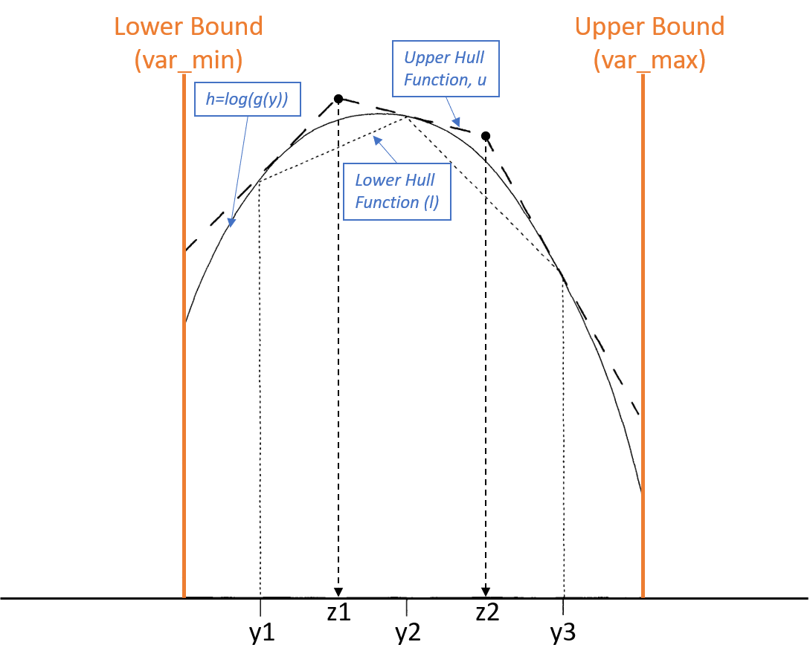
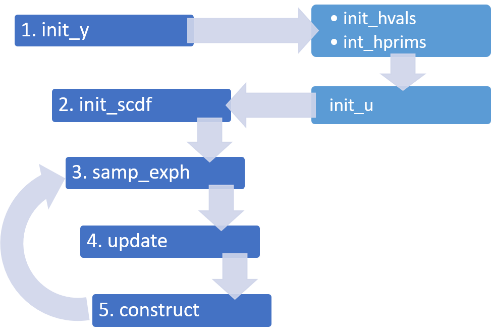
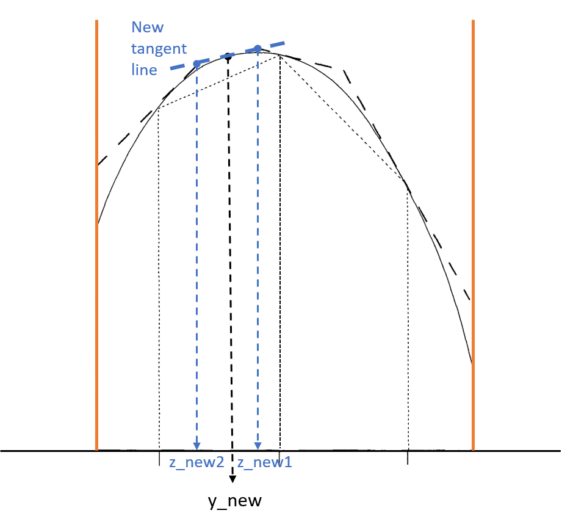

**INTRODUCTION**
================

### CONTRIBUTORS
[Yulun "Rayn" Wu](https://github.com/yulun-rayn), Andrea Bonilla, [Dingxin Cai](https://github.com/dxcai)

### Algorithm

-   Pass the user-defined function *f*(*y*) with appropriate bounds, if
    applicable
-   Perform preliminary checks on the function, including ensure the
    positivity of the function within the given support
-   Calculate the log density of *f*(*y*), which is
    *h*(*y*) = *l**o**g*(*f*(*y*)), and the derivative of the log
    density *h*′(*y*)
-   Find the piece-wise linear upper bound, *u*(*y*), to the log-density
    function, by evaluating the tangent lines at the fixed points at
    *h*(*y*); the equation for finding *u*(*y*) is:
    *u*(*y*) = *h*(*y*<sub>*j*</sub>) + (*y* − *y*<sub>*j*</sub>)*h*′(*y*<sub>*j*</sub>)
-   tangent lines can be expressed as:
    $z\_j=\\frac{h(y\_{j+1})-h(y\_j)-y\_{j+1}h'(y\_{j+1})+y\_jh'(y\_j)}{h'(y\_j) - h'(y\_{j+1})}$
-   Find the piece-wise linear lower bound, *l*(*y*), formed by the
    chords between the fixed points on *h*(*y*); the equation for the
    lower bound is:
    $l(y) = \\frac{(y\_{j+1}-y)h(y\_j) + (y-y\_j)h(y\_{j+1})}{y\_{j+1}-y\_j}$
-   Sample based on $s= \\frac{exp(u(y))}{\\int exp(u(y')dy')}$ by
    implementing the inverse transform sampling method
-   Make necessary updates on the upper and lower bound of the
    log-density function: if the sample point passes the squeezing test,
    the point is accepted; else we use the rejection test on the sample
    point. If it is not accepted, the upper and lower bounds will be
    updated accordingly. Therefore, the squeezing test greatly improves
    the efficiency. The program stores the sample points and update only
    when the sampled point failed both the squeezing and the rejection
    tests. Memory use is also improved as a result.

Below is a graph showing the notation of the algorithm used in the
program documentation. 

### Validity

-   The probability of x being sampled is:
    $P(\\text{x is sampled}) = \\frac{exp(u(x))}{\\int exp(u(x')dx')}$

-   The probability of x being accepted given x is sampled is:
    *P*(x is accepted \| x is sampled) = *e**x**p*(*h*(*x*) − *u*(*x*))

-   By the Bayes’ theorem, *P*(x is sampled \|x is accepted) can be
    expressed as:

### ars Package Set-up

Below is an example code chunk to set up the ars package (as well as a
working example) from the assigned GitHub repository:

``` r
devtools::install_github("andrea2910/ars")

library(ars)
ex <- ars::ars$new(funx=dnorm, D=c(-5,5))
# ex <- ars::ars$new(funx=dnorm, D=c(0,10), mean=5, sd=3) # also works
samples <- ex$sample(n=2000)
ex$plot_samples()  
# plots our histogram of samples with a blue line highlihting median
ex$plot_sampdist()
# plots our normalized envelope method
ex$plot_u_l()
# plots our last upper and lower hull functions when the algorithm concludes
```

The user is allowed to input any function, funx, and can input the
dimensions, D, the pdf is valid. The user can also input additional
arguments in our function. For example
`ars::ars$new(funx=dnorm, D=c(0,10), mean=5, sd=3)` is a valid input.

Please note, if your function has certain bounds, then you should write
`ars::ars$new(funx=dnorm, mean=3000, sd=1)` and then run
`sample(init_l=2999, init_r=3010)` or
`ars::ars$new(funx=dnorm, D=c(2990, 3010), mean=3000, sd=1)` and then
run `sample()`.

### GitHub Usernames and Repository

GitHub usernames of the group members are: Andrea - **andrea2910**,
Dingxin - **dxcai**, and Yulun - **yulun-rayn**. The initial version of the
project resides in Andrea’s GitHub account.

Function explanations are embedded in the package and can be accessed
using the `?` function or `help(ars)` in R.

**SPECIFIC APPROACHES**
=======================

### Structure

##### R6 Class

R6 classes are used to manage and organize the variables and functions
within the implemented algorithm. The figure below demonstrates the main
R6 class, named the *ARS Class*, in the package. 

Functions for each step in the algorithm are included in the public
domain of the class. The main functions in the class are the sampling
and updating functions, which are explained in detail in the next
section.

Below shows a figure of how the functions in the ARS class connect with
each other. The procedure will be carried out when a user-defined
function is passed on. The program will start with a set of fixed
starting points y. The h and h’ values at different y’s will then be
computed, which are used to construct the u function. Then the
cumulative distribution functions at each section bounded by the
different z values will be calculated for next-step sampling. Points
will be sampled and tested. If rejected, the sample is added to the set
of fixed points, which updates the upper bound. The sampling and
updating process will be repeated until enough points have been sampled.



We also create an additional R6 Class called namedVectors to help store
our data efficiently. We associate a vector of names and values to
represent data points on the x-axis and y-axis (i.e. x and h(x)),
respectively.

##### Functions and Objects

In the initial step, the following functions (re)create these private
objects:

-   `init_y`: private$y
-   `init_hval`: private$h\_vals
-   `init_hprim`: private$h\_prims
-   `init_u`: private$z, private$u\_vals
-   `init_scdf`: private$s\_cdfs

In updating step, `update` function updates the above objects after a
new sample point is included.

The figure below shows what the changes would be if the sampled point is
within the supports (slightly different situation when the sampled point
is at the domain boundaries). A new y value (*y*<sub>*n**e**w*</sub>)
will be added to `init_y`. The corresponding
*h*(*y*<sub>*n**e**w*</sub>) and
*h*<sup>′</sup>(*y*<sub>*n**e**w*</sub>) will be added to `h_vals` and
`h_prim`. The point *z*<sub>*i*</sub> will be replaced by
*z*<sub>*n**e**w*1</sub> and *z*<sub>*n**e**w*2</sub> and `u_vals` will
be updated accordingly. `s_cdfs` will be updated to include the two new
sections, which replaced the old section between *z*<sub>*i*</sub> and
*z*<sub>*i* + 1</sub>.



### Checks

To start the ars algorithm, a valid function should be passed on to the
program. The function should be positive, differentiable and log-concave
in the given support. Some of these might not necessarily be checked at
the beginning.

##### Log-concavity

If we check concavity at the beginning by sampling a lot of random
points within the domain to avoid falling into a pattern where there are
negative points but we could never find it, we have to calculate h and
h\_prim values, which somewhat contradicts the efficiency purpose of
squeezing test. The squeezing test allows us to only update h and
h\_prim as needed, and not every round of sampling. If we had already
calculated a lot of points’ h and h\_prim values, we might as well store
them and create an initial upper and lower hulls, which are already very
close to the actual function. This not only is very costly but also
makes the actual steps of ARS not as useful and essential anymore.

While we do not check log-concavity initially, we check every time a new
point is added. If a large number of points are sampled, it is very
unlikely that a non-log-concave function will not be detected during the
process. However, if the user is paranoid about this happening, or the
result fails the KS test, or they find the result to be suspicious. We
also provide a squeeze=FALSE option for the user to disable the
squeezing test, in which case even if the function is not log-concave,
it would still give a theoretically valid sample of the input
distribution, if it happens that no non-log-concave upper hull is
created.

In terms of efficiency, we also have to sample points and calculate h
and h\_prim if we check concavity initially, and it is very likely that
we will find the non-log-concavity points in a sample size that is way
smaller than the sample size for ARS. If the input is indeed
log-concave, our method is definitely more efficient; if the input is
not log-concave, the check initially will be more efficient but it is
very likely that there won’t be much difference. For the purpose of this
package, we care more about the former situation, so our method is
generally more efficient as well.

##### Continuous and Differentiable

For the same reason as log-concavity, we don’t check whether the
function is continuous and differentiable initially. Note that we only
check if the derivative is finite. If the left derivative and right
derivative of a point are not equal, we take the mean of the two and
form the upper hull, which will still be valid if h is concave.

##### Positivity

Positivity (*f*(*x*) &gt; 0) is a little different than the above
qualities because without it, the input isn’t even a density and none of
the following steps make sense. Even if we disable squeezing test, the
result would make no sense if no error is detected. For this property,
we check it initially, by taking a fixed number of points on our
function f. Note that an invalid input can still get away with this
check. We include an additional check while calculating h, before
calculating h\_prim (which is a lot more costly than calculating h). It
would not be very efficient to check h\_prim values before checking
whether h values are negative. If in any of the intermediate steps of
ARS we get a point whose h value is negative, we also stop and report
the error.

### Starting points

We first initialize up to 2 starting points depending on the boundary.

When f is already semi-positive and integrable, *x*<sub>1</sub> (the
first point) needs to be located such that *h*′(*x*) &gt; 0 if the
defined domain is unbounded on the left. We find this point by picking a
intial point and continuously shifting towards left until a point that
satisfies this condition is found. Note that when the base assumption,
any PDF of the function is semi-positive-definite, is satisfied, there
must exist a point *y* : *y* &lt; *x* such that *h*′(*y*) &gt; 0 for any
x. Likewise, if the domain is unbounded on the right, we find the
initial point on the right side by continuously shifting towards the
right until *h*′(*x*) &lt; 0 is satisfied.

The initial points are set to -1 and 1 by dafault. Note that these two
values can be inappropraite for some certain distribution the user
inputs(e.g. *N*(10000, 1)). So we give users the option to set these two
values in `sample()` as arguments `init_l` and `init_r`.

The step of each shift is determined by: 1) the scale of *h*(*x*) for
the current point x, and 2) a random value sampled by `runif`. The
reason for this is to make sure that the following two circumstances
wouldn’t prevent us from finding a proper initial point: 1) *h*′(*x*)
changes very slowly through distance, and 2) *h*(*x*) is periodic.

### Sampling

The R6 class function `samp_exph` uses the inverse transform sampling
method to perform the sampling:

-   The CDF of x is represented as F, where F is increasing. We then
    have
    *P*(*F*(*x*) &lt; *y*) = *P*(*x* &lt; (*F*<sup> − 1</sup>(*y*)) = *F*(*F*<sup> − 1</sup>(*y*)) = *y*
-   Thus *F*(*x*) ∼ *U**n**i**f*\[0, 1\], we sample from
    *U**n**i**f*\[0, 1\] and get x by *F*<sup> − 1</sup>(*u*).

### Special cases

##### Sampled point in linear interval

In some distribution there might exists sub-domains in which
*h*(*x*) = *a**x* + *b*. If we sample a point from this region, the
point will definitely be accepted but we can’t determine what the new z
points are, and the upper hull would not change either. In this case, we
don’t update even if it does to rejection test. The way to identify this
case is rounding the difference of the slopes between the new y and the
two old y’s next to it, to a level where it is significantly smaller
than the slopes and larger than machine epsilon.

##### Value 0 in given support

The condition of ARS is that the support of the input function is
connected, in the case of 1-dimension, a single interval. However, we
don’t stop the process and report an error if a point x in the support
is found such that *f*(*x*) = 0, because it could happen that a point is
sampled and the f of it is not zero analytically but is zero in R
(e.g. normal distribution, *μ* = 5, *σ* = 2, *x* = 100). If such a point
was found, we simply reject this point and do not update the hulls and
move on. For the case that *f*(*x*) is indeed zero, it is theoretically
valid to simply reject it. And the input is also not log-concave in this
case, so it can be classified to the problem of detecting
non-log-concavity, which we discussed above. For the case that *f*(*x*)
is just zero in R, it happens extremely rarely (similar to sampling a
*x* = 100 from *N*(5, 4)) and the effect of just rejecting it can be
trivial.

**TESTING**
===========

The test file in our package can be run with the following command
`devtools::test()` once you are in our main folder. Similarly, the
following code works if run sequentially:
`library(testthat); library(ars); test_package("ars")` The tests are
broken up into 3 files:

-   `test_helper.R`: This confirms our helper functions are correct,
    including calculating derivatives, creating upper and lower hull
    functions, and checking whether our function is concave at certain
    points. It also confirms our `namedVector` class works the way it
    was intended too, which helps our ars method.
-   `test_ars_output.R`: This confirms our `ars` function breaks when
    the bounds are incorrect, i.e. an exponential distribution with
    negative bounds, our `$sample()` method creates the correct output
    length, and our `ars$new()` method breaks when a function or
    incorrect dimensions is not inputted
-   `test_ars_ks.R`: To confirm whether the ars data algorithm works, we
    compare samples generated from our function and corresponding r
    method codes, i.e `rnorm`, `runif`, and others. To compare the
    validity we use the Kolmogorov-Smirnov test to compare the sameness
    of our continuous distributions.

While running tests, the code also outputs warnings, which usually say:
“Input function is not normalized. The pdf does not integrate to 1”.
This is okay as we check whether the pdf integrates to 1, or near one
with some tolerances.

------------------------------------------------------------------------

**REFERENCES**
==============

1.  W. R. Gilks, P. Wild (1992), “Adaptive Rejection Sampling for Gibbs
    Sampling,” Applied Statistics, Vol. 41, Issue 2, 337-348.
2.  C. N. Kohnena (2002), “Adaptive Rejection Sampling,” Statistical
    Science, Duke University.
    [link](http://www2.stat.duke.edu/~cnk/Links/slides.pdf)
3.  Inferentialist Consulting (2016), “\[R\] Adaptive Rejection
    Sampling,” *blog.inferentialist.com*.
    [link](https://blog.inferentialist.com/2016/09/26/adaptive-sampling.html)
